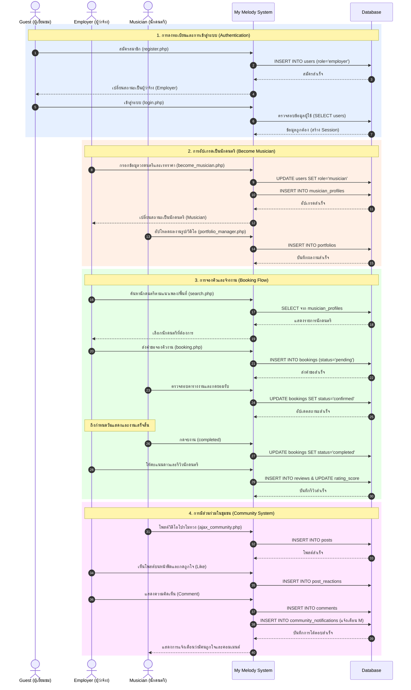

# ⏱️ แผนภาพลำดับเหตุการณ์แบบครอบคลุม (Comprehensive Sequence Diagram)

แผนภาพด้านล่างนี้แสดงลำดับเหตุการณ์แบบ **End-to-End** ของระบบ MY MELODY ตั้งแต่ผู้ใช้ทั่วไปเข้ามาสมัครสมาชิก การอัปเกรดเป็นนักดนตรี การค้นหาและจ้างงาน ไปจนถึงการใช้งานระบบชุมชน (Community) ในภาพเดียวครับ

### 💡 สรุปขั้นตอนการทำงาน (Flow Summary):
1. **สีฟ้า (Authentication):** ผู้เยี่ยมชมสมัครสมาชิก ระบบจะตั้งค่าเริ่มต้นให้เป็น **Employer (ผู้ว่าจ้าง)**
2. **สีส้ม (Profile Setup):** หากต้องการรับงาน ผู้ว่าจ้างสามารถมากรอกข้อมูลและอัปเกรดตัวเองเป็น **Musician (นักดนตรี)** พร้อมตั้งค่าพอร์ตโฟลิโอได้
3. **สีเขียว (Booking):** เป็นระบบหลัก (Core Flow) ที่ผู้ว่าจ้างสามารถค้นหานักดนตรี ส่งคำขอจ้างงาน นักดนตรีกดยอมรับ เมื่อจบงานผู้ว่าจ้างทำการรีวิว
4. **สีชมพู (Community):** ระบบโซเชียลที่ทุกบทบาท (Employer และ Musician) สามารถมาตั้งโพสต์ พูดคุย และกดรีแอคชันโต้ตอบกันได้ พร้อมระบบแจ้งเตือน
