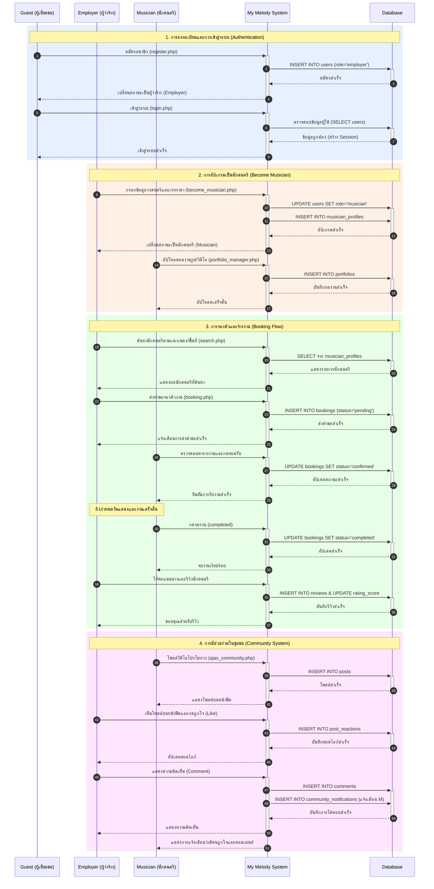

# แผนภาพลำดับเหตุการณ์ (Sequence Diagram)

แผนภาพลำดับเหตุการณ์ระบบ MY MELODY (ปรับรูปแบบเป็นกล่อง Participant และเพิ่ม Activation Box ตามตัวอย่าง)

```mermaid
sequenceDiagram
    autonumber
    
    %% เปลี่ยนจาก actor เป็น participant เพื่อให้แสดงเป็นกล่องสี่เหลี่ยมเหมือนในรูปตัวอย่าง
    participant G as Guest (ผู้เยี่ยมชม)
    participant E as Employer (ผู้ว่าจ้าง)
    participant M as Musician (นักดนตรี)
    participant S as My Melody System
    participant DB as Database

    %% 1. การเข้าสู่ระบบและสมัครสมาชิก
    rect rgb(230, 240, 255)
        Note over G, DB: 1. การลงทะเบียนและการเข้าสู่ระบบ (Authentication)
        G->>+S: สมัครสมาชิก (register.php)
        S->>+DB: INSERT INTO users (role='employer')
        DB-->>-S: สมัครสำเร็จ
        S-->>-G: เปลี่ยนสถานะเป็นผู้ว่าจ้าง (Employer)
        
        G->>+S: เข้าสู่ระบบ (login.php)
        S->>+DB: ตรวจสอบข้อมูลผู้ใช้ (SELECT users)
        DB-->>-S: ข้อมูลถูกต้อง (สร้าง Session)
        S-->>-G: เข้าสู่ระบบสำเร็จ
    end

    %% 2. การเป็นนักดนตรีและการจัดการผลงาน
    rect rgb(255, 240, 230)
        Note over E, DB: 2. การอัปเกรดเป็นนักดนตรี (Become Musician)
        E->>+S: กรอกข้อมูลวงดนตรีและเรทราคา (become_musician.php)
        S->>+DB: UPDATE users SET role='musician'
        S->>DB: INSERT INTO musician_profiles
        DB-->>-S: อัปเกรดสำเร็จ
        S-->>-E: เปลี่ยนสถานะเป็นนักดนตรี (Musician)
        
        M->>+S: อัปโหลดผลงานรูป/วิดีโอ (portfolio_manager.php)
        S->>+DB: INSERT INTO portfolios
        DB-->>-S: บันทึกผลงานสำเร็จ
        S-->>-M: อัปโหลดเสร็จสิ้น
    end

    %% 3. การค้นหาและระบบจ้างงาน (Core System)
    rect rgb(230, 255, 230)
        Note over E, DB: 3. การจองคิวและจ้างงาน (Booking Flow)
        E->>+S: ค้นหานักดนตรีตามแนวเพลง/พื้นที่ (search.php)
        S->>+DB: SELECT จาก musician_profiles
        DB-->>-S: แสดงรายการนักดนตรี
        S-->>-E: แสดงผลนักดนตรีที่ค้นหา
        
        E->>+S: ส่งคำขอจองคิวงาน (booking.php)
        S->>+DB: INSERT INTO bookings (status='pending')
        DB-->>-S: ส่งคำขอสำเร็จ
        S-->>-E: แจ้งเตือนการส่งคำขอสำเร็จ
        
        M->>+S: ตรวจสอบตารางงานและกดยอมรับ
        S->>+DB: UPDATE bookings SET status='confirmed'
        DB-->>-S: อัปเดตสถานะสำเร็จ
        S-->>-M: ยืนยันการรับงานสำเร็จ
        
        Note over E, M: ถึงกำหนดวันแสดงและงานเสร็จสิ้น
        
        M->>+S: กดจบงาน (completed)
        S->>+DB: UPDATE bookings SET status='completed'
        DB-->>-S: อัปเดตสำเร็จ
        S-->>-M: จบงานเรียบร้อย
        
        E->>+S: ให้คะแนนดาวและรีวิวนักดนตรี
        S->>+DB: INSERT INTO reviews & UPDATE rating_score
        DB-->>-S: บันทึกรีวิวสำเร็จ
        S-->>-E: ขอบคุณสำหรับรีวิว
    end

    %% 4. ระบบชุมชน (Community & Feed)
    rect rgb(255, 230, 255)
        Note over E, DB: 4. การมีส่วนร่วมในชุมชน (Community System)
        M->>+S: โพสต์วิดีโอโปรโมทวง (ajax_community.php)
        S->>+DB: INSERT INTO posts
        DB-->>-S: โพสต์สำเร็จ
        S-->>-M: แสดงโพสต์บนหน้าฟีด
        
        E->>+S: เห็นโพสต์บนหน้าฟีดและกดถูกใจ (Like)
        S->>+DB: INSERT INTO post_reactions
        DB-->>-S: บันทึกยอดไลก์สำเร็จ
        S-->>-E: อัปเดตยอดไลก์
        
        E->>+S: แสดงความคิดเห็น (Comment)
        S->>+DB: INSERT INTO comments
        S->>DB: INSERT INTO community_notifications (แจ้งเตือน M)
        DB-->>-S: บันทึกการโต้ตอบสำเร็จ
        S-->>-E: แสดงความคิดเห็น
        
        S-->>M: แสดงการแจ้งเตือนว่ามีคนถูกใจและคอมเมนต์
    end
```