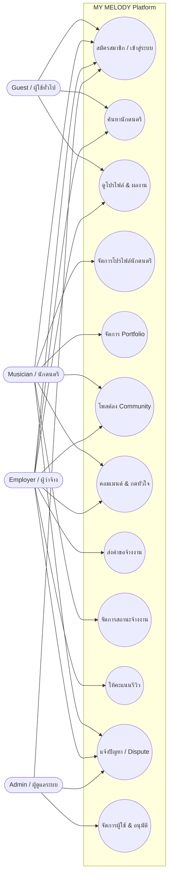

# 🎸 Design Overview: MY MELODY Platform

**MY MELODY** เป็นแพลตฟอร์มเว็บแอปพลิเคชันสำหรับการค้นหา ว่าจ้างนักดนตรี และเป็นชุมชน (Community) สำหรับคนที่รักในเสียงดนตรี ระบบถูกออกแบบมาให้ทำหน้าที่เป็นตัวกลางเชื่อมระหว่าง **นักดนตรี (Musician)** ที่ต้องการรับงานแสดง และ **ผู้ว่าจ้าง (Employer)** ที่ต้องการหานักดนตรีไปเล่นในงานต่างๆ

## 🛠️ Technology Stack
- **Frontend**: HTML5, CSS3, JavaScript (Bootstrap 5 เฟรมเวิร์กสำหรับการแสดงผลแบบ Responsive)
- **Backend**: PHP (รูปแบบ Procedural / Script-based)
- **Database**: MySQL (เชื่อมต่อผ่าน PDO)

## 🏗️ System Architecture
สถาปัตยกรรมของระบบเป็นแบบ **Monolithic** โดยมีการแบ่งแยกหน้าการทำงานแต่ละฟังก์ชันออกเป็นไฟล์ย่อยๆ (เช่น `booking.php`, `portfolio_manager.php`) แต่ใช้ไฟล์ส่วนกลาง (เช่น `includes/header.php`, `includes/footer.php`, `includes/db.php`) เพื่อให้จัดการง่าย

## 🗄️ Database Design (Core Entities)
ระบบมีการจัดเก็บข้อมูลในรูปแบบ Relational Database โดยมีตารางหลักๆ ดังนี้:
1. `users`: เก็บข้อมูลบัญชีผู้ใช้งานทั้งหมด (แยก role: admin, musician, employer)
2. `musician_profiles`: เก็บรายละเอียดโปรไฟล์นักดนตรี (เรทราคา, แนวเพลง, สถานะยืนยันตัวตน)
3. `employer_profiles`: เก็บรายละเอียดผู้ว่าจ้าง
4. `portfolios`: เก็บผลงานของนักดนตรี (วิดีโอ, เสียง, รูปภาพ)
5. `posts` / `comments` / `post_reactions`: สำหรับระบบ Community / Feed
6. `bookings`: จัดการการจ้างงาน (วันที่, เวลา, สถานะ: pending, confirmed, ฯลฯ)
7. `reviews`: ระบบรีวิวหลังการจ้างงาน
8. `disputes`: ระบบแจ้งปัญหา

---

# 📊 Use Case Diagram

แผนภาพ Use Case แสดงให้เห็นถึงบทบาท (Actors) ที่แตกต่างกันและการปฏิสัมพันธ์กับระบบ

## 👥 คำอธิบายบทบาท (Actors)
1. **Guest (ผู้ใช้ทั่วไป)**
   - สามารถเข้าดูหน้าแรก ค้นหานักดนตรี และดูโปรไฟล์นักดนตรีเบื้องต้นได้
   - ต้องสมัครสมาชิกก่อนเพื่อใช้งานฟีเจอร์อื่นๆ
2. **Musician (นักดนตรี)**
   - สร้างและจัดการโปรไฟล์ (ใส่เรทราคา, ประวัติ, แนวเพลง)
   - อัปโหลด Portfolio (วิดีโอ, เสียง)
   - โพสต์แชร์สถานะลงในหน้า Community
   - จัดการคำขอจ้างงานจากผู้ว่าจ้าง (ยอมรับ / ปฏิเสธ)
3. **Employer (ผู้ว่าจ้าง)**
   - ค้นหาและดูโปรไฟล์ของนักดนตรี
   - ส่งคำขอจ้างงาน (ระบุวันที่, เวลา)
   - ให้คะแนนและรีวิวนักดนตรีหลังจบงาน
4. **Admin (ผู้ดูแลระบบ)**
   - ยืนยันตัวตน (Verify) ให้นักดนตรี
   - จัดการข้อพิพาทหรือปัญหา (Disputes) ที่ถูกแจ้งเข้ามา
   - ดูแลภาพรวมของระบบ
