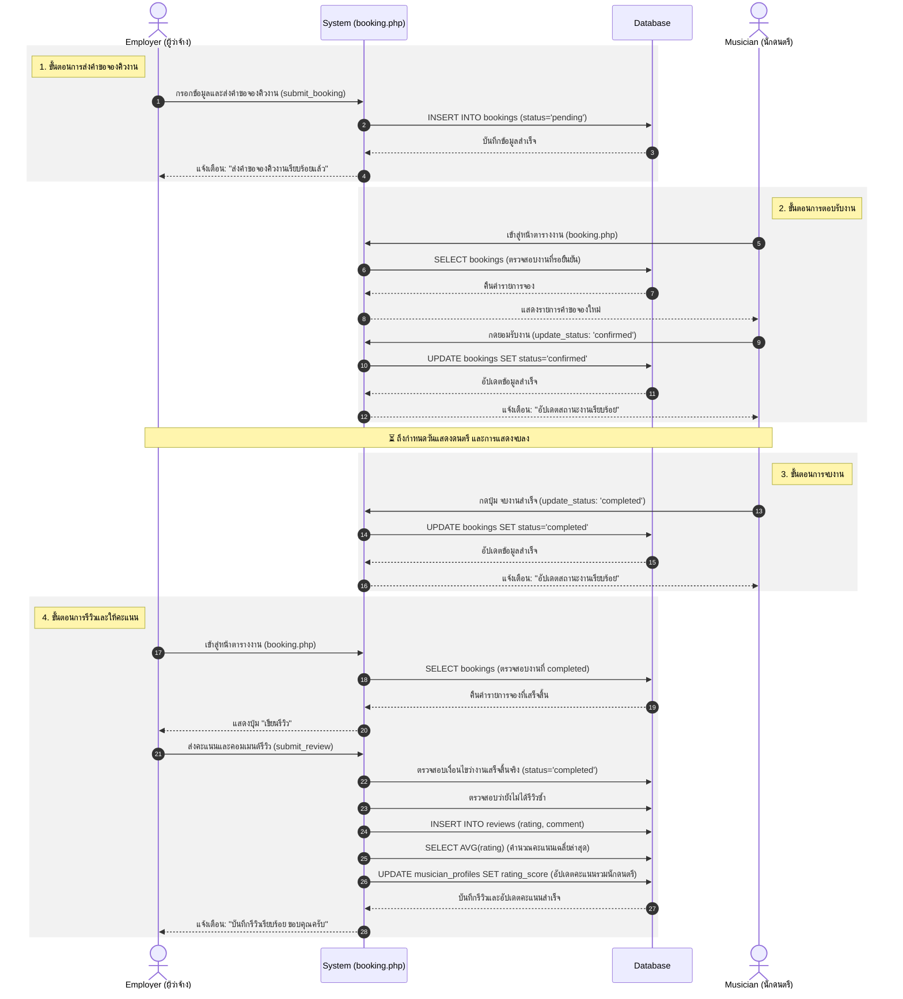

# ⏱️ Sequence Diagram: ระบบการจองคิวงานและรีวิวนักดนตรี

จากโครงสร้างโค้ดในไฟล์ `booking.php` ผมได้วิเคราะห์ขั้นตอนการทำงาน (Flow) ของระบบจ้างงานนักดนตรี ตั้งแต่เริ่มจองคิว ไปจนถึงจบงานและให้คะแนนรีวิว โดยเขียนออกมาเป็น **Sequence Diagram** (แผนภาพลำดับเหตุการณ์) ดังนี้ครับ:

### 💡 อธิบายเพิ่มเติม:
- **Employer (ผู้ว่าจ้าง):** เป็นจุดเริ่มต้นของ Flow โดยส่งคำขอจองคิว และเป็นผู้ปิดท้ายด้วยการรีวิว
- **Musician (นักดนตรี):** เป็นผู้ตรวจสอบคิวงาน ตอบรับ และเปลี่ยนสถานะเป็นจบงาน
- **System & Database:** ในแต่ละแอคชัน ระบบจะทำการ Query หรือ Update ข้อมูลในฐานข้อมูล (เช่น การเปลี่ยน `status` ระหว่าง pending -> confirmed -> completed) รวมถึงการคำนวณคะแนนเฉลี่ยนักดนตรีให้แบบอัตโนมัติเมื่อมีการรีวิวครับ
