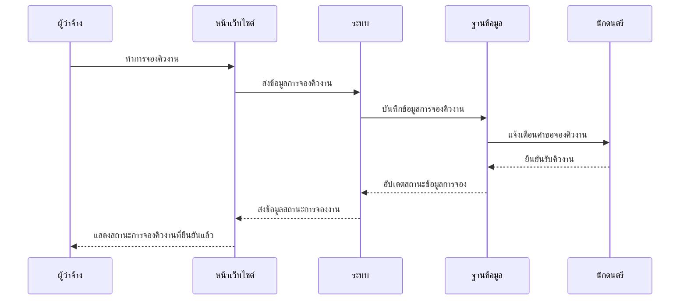

# ⏱️ แผนภาพลำดับเหตุการณ์การจองคิวงาน (Booking Sequence Diagram)

แผนภาพนี้ถูกปรับโครงสร้างให้มี 5 ส่วนประกอบ (ผู้ว่าจ้าง, หน้าเว็บไซต์, ระบบ, ฐานข้อมูล, นักดนตรี) โดยจำลองรูปแบบการไหลของข้อมูลให้ใกล้เคียงกับภาพตัวอย่างที่คุณส่งมาครับ

