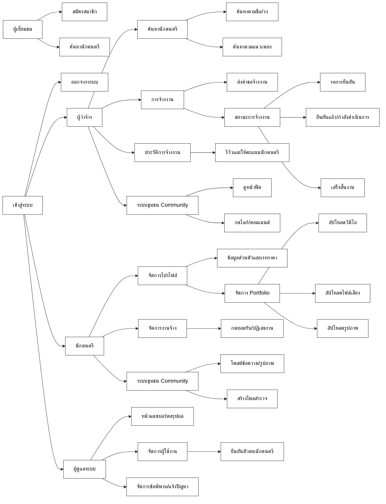

# 🗺️ System Flowchart (Information Architecture)

แผนผังด้านล่างนี้ออกแบบตามรูปแบบที่คุณส่งมาครับ โดยแสดงลำดับขั้นการเข้าถึงฟีเจอร์ต่างๆ ของระบบ MY MELODY แบ่งตามบทบาทของผู้ใช้งาน (ผู้ว่าจ้าง, นักดนตรี, และแอดมิน)

แผนผังนี้ (Information Architecture) จะช่วยให้เห็นภาพรวมได้ทันทีว่า เมื่อผู้ใช้เข้าสู่ระบบมาแล้ว จะสามารถแยกไปใช้งานฟีเจอร์ใดได้บ้าง เหมือนกับตัวอย่างที่คุณส่งมาเลยครับ หากต้องการปรับเปลี่ยนคำไหนสามารถแจ้งได้เลยครับ
